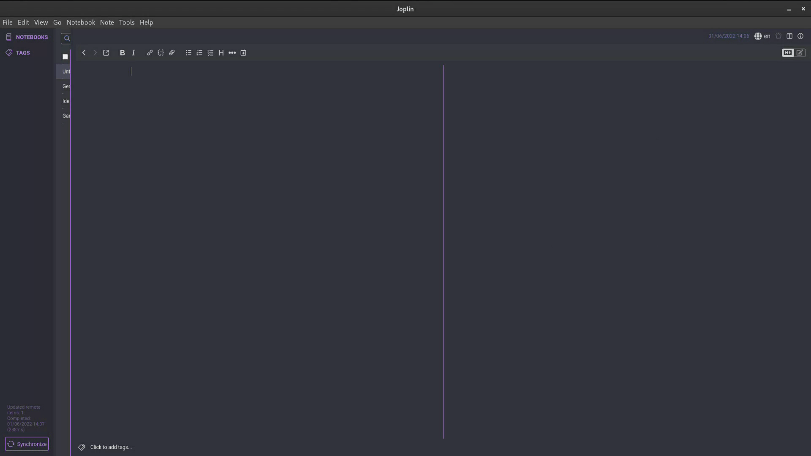

# kaomoji picker GTK app

Welp. I wanted one so I could do this ¯\\\_(ツ)\_/¯. Here it is.

I use it with Gnome DE and a custom hotkey to quickly find and copy my emotes.

## Install

Install python requirements with:

`pip3 install -r requirements.txt`

Non-python requirements are:

```
gtk3.0+
xsel
python3
```

## Run

`./main.py`

## Use

You will be presented with a window if everything works fine.

You can use the entry bar at the top to filter your mojis and the list below for copying mojis to clipboard.



## Configure and extend

Configuration constants are available at _meta.py_.

You can put your own sets of kaomojis into _mojis.py_ but don't forget to call `rootWin.populate(yourSet)` in _main.py_ afterwards.
